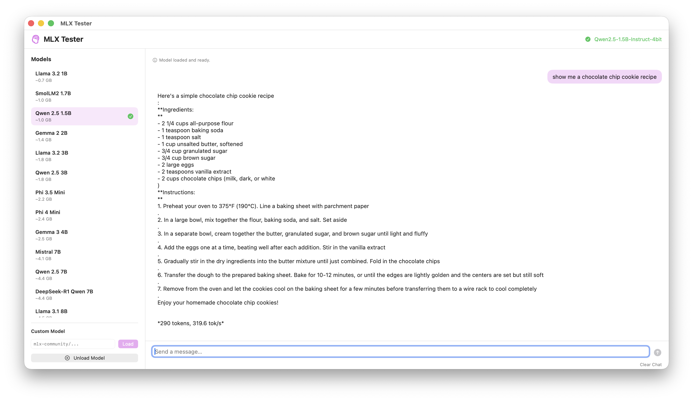

# MLX Tester

A native macOS app for testing MLX language models locally. Pick a model, load it, and chat — all running on Apple Silicon via [MLX](https://github.com/ml-explore/mlx).



## Features

- **One-click model loading** — choose from 16 preset models (Llama, Gemma, Qwen, Mistral, Phi, DeepSeek, and more) or enter any `mlx-community` repo
- **Chat interface** — send prompts and stream responses in real time with token/s stats
- **Fully local** — all inference runs on-device using your Mac's unified memory

## Requirements

- macOS 14+
- Apple Silicon Mac
- Python 3.13
- ~0.7 GB to ~38 GB free memory depending on model size

## Getting Started

### Run from source

```bash
./run.sh
```

### Build a DMG

```bash
./build_dmg.sh
```

This compiles the Swift app, bundles the Python scripts and a virtual environment with all dependencies, and produces a distributable `.dmg`.

## Models

| Size | Examples |
|------|----------|
| Small (< 2 GB) | Llama 3.2 1B, SmolLM2 1.7B, Qwen 2.5 1.5B, Gemma 2 2B |
| Medium (2–5 GB) | Phi 4 Mini, Gemma 3 4B, Mistral 7B, Llama 3.1 8B |
| Large (8+ GB) | Gemma 3 12B, Mistral Small 24B, Llama 3.3 70B |

You can also load any Hugging Face model from the `mlx-community` namespace using the custom model field.

## Architecture

- **Swift/SwiftUI** frontend (`Sources/`) — native macOS window with model picker and chat panels
- **Python backend** (`Scripts/`) — `mlx_interactive.py` runs as a subprocess, communicating over stdin/stdout with a simple text protocol
- Models are downloaded and cached by Hugging Face Hub on first use
